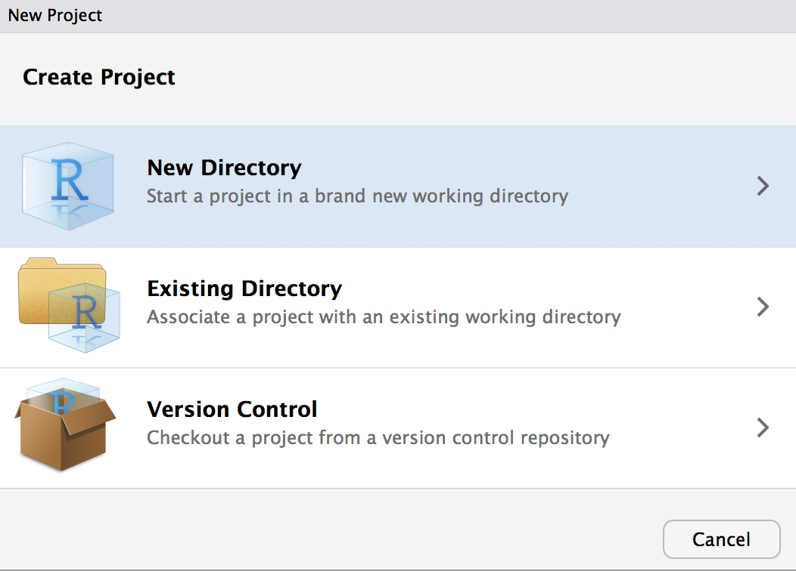
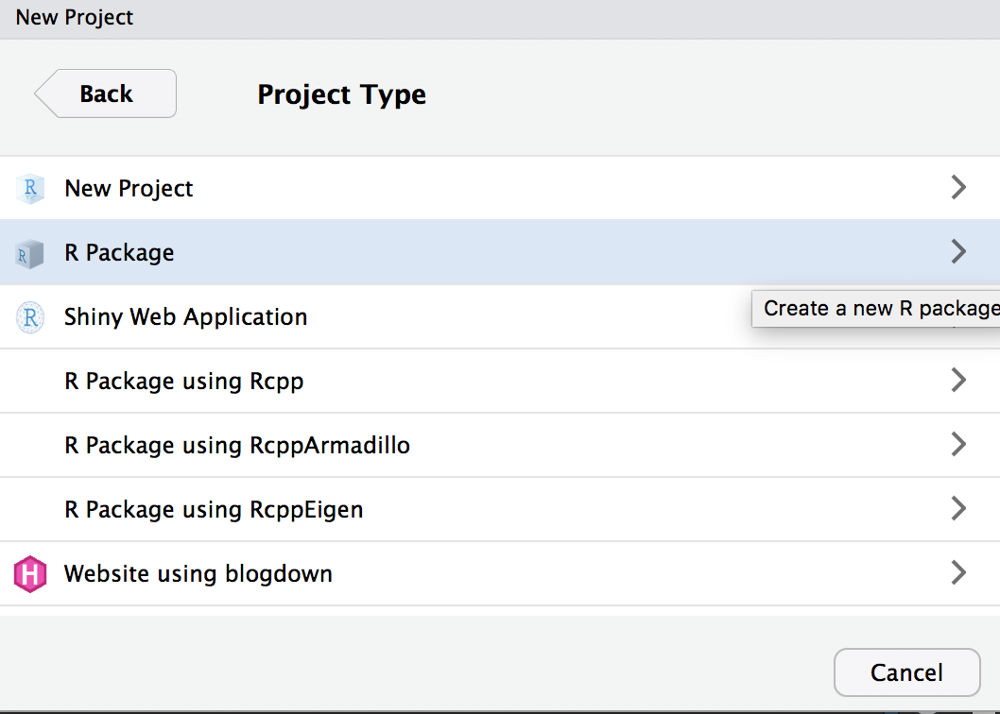

```{r eval=TRUE, echo=FALSE, warning=FALSE, message=FALSE, comment=""}
knitr::opts_chunk$set(echo = TRUE,
                      eval = TRUE,
                      warning = FALSE,
                      message = FALSE,
                      comment = "",
                      fig.height = 10,
                      fig.width = 10,
                      out.height = 300,
                      out.width = 300)
options(dplyr.print_max = 1e9)
```

# はじめに

## 誰？

<div class="column1">
- 松村優哉
- <u>Twitter</u>: **y\_\_mattu**
- <u>GitHub</u>: **ymattu**
- M1
- 計量経済学、ベイズ統計、因果推論、マーケティング
- 言語: R(歴は 3 年), SAS, Python
- https://ymattu.github.io/
- http://y-mattu.hatenablog.com/
- Tokyo.R / Japan.R 運営
</div>

<div class="column2">

</div>

## 著書(共著)
<div class="column1">

</div>

<div class="column2">
- 2部構成
- 第一部(基礎編)
    - R 入門
    - R のデータハンドリング基礎
- 第二部(応用編)
    - テキストマイニング
    - R のパフォーマンス向上
    - 地理データ解析
    - ベイズ最適化入門
    - ...etc
</div>

## お仕事
- スマホのチャットアプリのログ解析(インターン)
- Web 広告の配信最適化(インターン)
- 自然言語処理系、画像解析(現インターン)
- お仕事募集してます...!

## 作ったパッケージ
### [MlBayesOpt](https://github.com/ymattu/MlBayesOpt)
- 機械学習のパラメーターをベイズ最適化でチューニングする R パッケージ
- メンテ頑張ります...

### [rjumanpp](https://github.com/ymattu/rjumanpp)
- 形態素解析機 JUMAN++ の R ラッパー
- 最低限の機能しかないのでメンテ頑張ります...

### [HindiMorph](https://github.com/ymattu/HindiMorph)
- ヒンディ語の形態素解析器のラッパーパッケージ
- **今日はこの話と、パッケージの作り方入門的な話を。**


# 改めて、今回の内容
## R のパッケージ作成について
- HindiMorph パッケージ小話
- なんでパッケージを作るの？
- パッケージっを作るのって難しいんじゃないの？
- イマドキな「パッケージ作成法」
- 簡単なデモ

# 事の始まり
## ある日

<div class="line-bc">
<div class="kaiwa">
 <figure class="kaiwa-img-left">
   
 <figcaption class="kaiwa-img-description">
 </figcaption>
 </figure>
 <div class="kaiwa-text-right">
   <p class="kaiwa-text">
ヒンディー語の形態素解析をやりたい友 <br> 達がいて...
   </p>
 </div>
</div>

<div class="kaiwa"">
 <figure class="kaiwa-img-right">
   
 <figcaption class="kaiwa-img-description">
 </figcaption>
 </figure>
 <div class="kaiwa-text-left">
   <p class="kaiwa-text">
?????
   </p>
 </div>
</div>

<div class="kaiwa">
 <figure class="kaiwa-img-left">
   
 <figcaption class="kaiwa-img-description">
 </figcaption>
 </figure>
 <div class="kaiwa-text-right">
   <p class="kaiwa-text">
形態素解析器はあるにはあるんですけど <br> Python製で...
   </p>
 </div>
</div>

<div class="kaiwa"">
 <figure class="kaiwa-img-right">
   
 <figcaption class="kaiwa-img-description">
 </figcaption>
 </figure>
 <div class="kaiwa-text-left">
   <p class="kaiwa-text">
ほう...?
   </p>
 </div>
</div>

<div class="kaiwa">
 <figure class="kaiwa-img-left">
   
 <figcaption class="kaiwa-img-description">
 </figcaption>
 </figure>
 <div class="kaiwa-text-right">
   <p class="kaiwa-text">
ラッパーパッケージみたいなのを作って <br> ほしいんですよね
   </p>
 </div>
</div>

<div class="kaiwa"">
 <figure class="kaiwa-img-right">
   
 <figcaption class="kaiwa-img-description">
 </figcaption>
 </figure>
 <div class="kaiwa-text-left">
   <p class="kaiwa-text">
はあ...
   </p>
 </div>
</div>

<div class="kaiwa">
 <figure class="kaiwa-img-left">
   
 <figcaption class="kaiwa-img-description">
 </figcaption>
 </figure>
 <div class="kaiwa-text-right">
   <p class="kaiwa-text">
よろしくお願いします!
   </p>
 </div>
</div>


<div class="kaiwa"">
 <figure class="kaiwa-img-right">
   
 <figcaption class="kaiwa-img-description">
 </figcaption>
 </figure>
 <div class="kaiwa-text-left">
   <p class="kaiwa-text">
決定!!!!???
   </p>
 </div>
</div>
</div>

- 実際にはもう少しやり取りがありました。

# で、作りました
## HindiMorph パッケージ
- https://github.com/ymattu/HindiMorph
- 関数1つだけのシンプルなパッケージ

## 入力
テキストを含むデータフレーム

```{r}
tw <- HindiMorph:::tw_text2
tw
```

## 出力
単語に品詞とテキストIDが付与されたデータフレーム

```{r}
library(HindiMorph)
res <- hindi_morph(tw, text_col = text)
res
```

## (一応)内部でやってること
- Python スクリプトを叩いてるだけ
    - Python が品詞を付与したファイルを出力するのでそれをRで読んで加工
    - なのでPython環境が必要(pyenv, python2.7.13)
    - (たぶん)Windowsでは動かない
- この辺は限定的な用途で作ったのでお許しを...
    - 多くの場合、パッケージを作るときはどのOSでも動くように設計します。

# ここで寄り道
## なんでパッケージにするか
- **パッケージとは、関数の集まり**
- 関数を書いて `source()` で読み込めば外の関数は使える

## 例
- 関数を書いたコード(`funcs.R`)


```{r, eval=FALSE}
func1 <- function (a, b) {
  res <- a ^ b
  return(res)
}

func2 <- ....
```

- 分析のコード

```{r}
source("funcs.R")

func1(2, 5)
```

## 関数をパッケージにするわけ
- 関数が多くなってくると管理が面倒
- 他人との共有
- 依存パッケージの問題


## パッケージを作るのって難しいんじゃないの？
- 高度なパッケージだと難しいです
- 関数が少なければそんなに難しくない
- でもパッケージ作成独特の作業あり
    - ドキュメント
    - テスト

# R パッケージを作る {#createpkg}
## 手順
1. (GitHub アカウントとレポジトリを作る)
2. プロジェクトを作る
3. 設計
4. 関数を書く
5. テストを書く
6. ドキュメントを書く
7. 3〜5 を繰り返す

# GitHub アカウントとレポジトリを作る
## 省略

# プロジェクトを作る
## RStudioがいいでしょう

## New Project


## R Package {#rpkg}
- このとき C++ を使うことが決まっていれば `R Package using Rcpp` などを選択
- そうすると必要なファイルとかを勝手に準備してくれる


## パッケージ名を入力
- Create a git repository には必ずチェック


## するとこんな感じ


# ディレクトリの説明
## .gitignore
- Git で変更履歴を記録しないファイル
- 必要に応じて追加

## .Rbuildignore
- パッケージをビルドするときに無視するファイル
- 基本いじらない

## DESCRIPTION
- パッケージの説明を書く

## man
- パッケージのドキュメント(ヘルプ)を組み立てる元のファイル
- **roxgen2** パッケージで自動生成されるのでいじらない

## NAMESPACE
- パッケージの依存関係とかが書かれるファイル
- **roxgen2** パッケージで自動生成されるのでいじらない

## R {#rfolder}
- Rの関数を書いてくフォルダ
- `.R` ファイルを追加していく

# まずはじめに
## DESCRIPTION を書く {#writedescription}
- 例: HindiMorph

```
Package: HindiMorph
Type: Package
Title: Morphological Analysis of Hindi
Version: 0.1.0
Author: Yuya Matsumura
Maintainer: Yuya Matsumura <mattu.yuya@gmail.com>
Description: Morphological Analysis of Hindi using the Python scripts from RDRPOSTagger (http://rdrpostagger.sourceforge.net/)
Depends: R (>= 2.10)
SystemRequirements: pyenv (2.7.13)
License: MIT + file LICENSE
Encoding: UTF-8
LazyData: true
Imports: 
    rlang,
    dplyr,
    tidyr,
    readr,
    stringr
Suggests: 
    testthat
RoxygenNote: 6.0.1
```

## 人手で書くところ
- Title
- Author
- Maintainer
- Description
- Depends: Rのバージョン
- SystemRequirements: あれば

# 関数を書く

## 関数を書くのですが
- `.R` ファイルに関数を書く
- このときにドキュメントの中身を一緒に書く
- roxgenコメントと呼ばれます

## こんな感じです
例: HidiMorph::hindi_morph

```{r, eval=FALSE}
##' Morphological Analysis Hindi Using RDRPOST
##'
##' @param data dataframe contains a column to analyze
##' @param text_col column name of the text toanalyze
##' @author Yuya Matsumura
##'
##' @importFrom rlang enquo !!
##' @importFrom dplyr as_data_frame select mutate rename filter row_number slice n %>%
##' @importFrom readr write_csv read_lines
##' @importFrom tidyr separate separate_rows
##' @importFrom stringr str_detect str_replace
##' @export
hindi_morph <- function(data, text_col) {

  # Select the column to analyze
  quolabel <- enquo(text_col)

  csvoutput <- data %>%
    select(!! quolabel)

  # Output to csv
  wd <- getwd()
  origin_file <- paste0(wd, "/morphtext.csv")
  write_csv(csvoutput, origin_file)

  # Make Command for Commandline
  srcfile <- system.file("py/RDRPOSTagger/pSCRDRtagger/RDRPOSTagger.py", package = "HindiMorph")
  cdpath <- str_replace(srcfile, "/RDRPOSTagger.py", "")
  # cdpath2 <- "/Users/ymattu/Desktop/HindiMorph/inst/py/RDRPOSTagger/pSCRDRtagger"
  pyenv_command <- "pyenv local 2.7.13 && pyenv rehash"
  rdr <- system.file("py/RDRPOSTagger/Models/POS/Hindi.RDR", package = "HindiMorph")
  dict <- system.file("py/RDRPOSTagger/Models/POS/Hindi.DICT", package = "HindiMorph")

  cmd <- paste("cd",
               cdpath,
               "&&",
               "python",
               srcfile,
               "tag",
               rdr,
               dict,
               origin_file)

  # Execute Command, then .TAGGED file will be made by Python Script
  system(cmd)

  # Read .TAGGED file
  taggedfile <- paste0(wd, "/morphtext.csv.TAGGED")

  # Data Wrangling
  res <- NULL
  value <- NULL
  morph <- read_lines(taggedfile) %>%
    as_data_frame() %>%
    slice(2:n()) %>%
    rename(res = value) %>%
    mutate(document_id = row_number()) %>%
    separate_rows(res, sep = " ") %>%
    filter(str_detect(res, "https|http|t.co") == FALSE) %>% # Delete urls
    filter(str_detect(res, "/[^A-Z]") == FALSE) %>% # Delete inappropriate rows
    separate(col = res, into = c("word","morph"), sep = "/")

  # Remove temporary files
  file.remove(origin_file)
  file.remove(taggedfile)

  # Output Tidy DataFrame
  return(morph)
}
```

## こんな感じです2 {#konnnakanji}
```{r,eval=FALSE}
##' Calculate a^b
##'
##' @param a numeric
##' @param b numeric
##' @author Yuya Matsumura
##' @examples
##' @export
##' aa <- 3
##' bb <- 2
##' cc <- kaijou(3, 2)
kaijou <- function (a, b) {
  res <- a ^ b
  return(res)
}
```

# ドキュメント項目の説明
## `@param` {#param}
- 引数の説明

## `@author` {#author}
あってもなくても

## `@importFrom` {#importfrom}
- 重要
- 外部パッケージの関数を読み込む
- これがないと外部パッケージは動きません
- ここにパッケージを書いたら `usethis::use_package("パッケージ名")` を実行
- DESCRIPTION に依存パッケージが記述される
- パッケージ丸々読み込みたいときは `@import`
    - 名前空間の衝突の可能性があるので非推奨
    
## `@examples` {#examples}
関数の使用例

## `@export` {#export}
- ユーザーが使える関数にしたいときは書く
- パッケージ内部の処理だけの関数なら不要

## 他には {#otherrox}
- http://r-pkgs.had.co.nz/man.html#roxygen-comments の Roxgen Comments を参照

## これを書いたら
- `devtools::document()` を実行
- `man` フォルダの中が更新される

# テストの記述

## テスト？
- 関数を書いてるとき、「正しく動くかどうか」を検証したい
- 一緒にテストを書いていくのがたぶん楽
- `usethis::use_test()` を実行
    - テストに必要なフォルダ構成、テスト用のファイルを作ってくれる
    

## テストの書き方
- 最低限
- 例: `kaijou()` 関数
- test-kaijou.R

```{r, echo=FALSE}
library(testthat)
```


```{r, eval=FALSE}
context("test-kaijou.R")

test_that("multiplication works", {
  res <- kaijou(2,3)
  expect_equal(res, 8)
})
```

## HindiMorPhの場合 {hinditest}
```{r, eval=FALSE}
library(HindiMorph)

context("Check hindi_morph()")

test_that("Moprph", {
  setwd(".")
  dat <- HindiMorph:::tw_text2
  res <- hindi_morph(dat, text)
  expected <- "\\u0924\\u0941\\u092e"
  expect_equal(stringi::stri_escape_unicode(as.character(res[5, 1])),
               expected)
})
```

## あれ、`"\\u0924\\u0941\\u092e"`って？
- テスト(と`.R`の中身)には非ASCII文字は書けません
- こういう文字を扱う場合は `stringi::stri_escape_unicode()` で変換して扱います

## 複数のテストをいっぺんに回したいときは
- `devtools::test()`

# ここまでの作業を繰り返します。
## 作ってるパッケージ自体を読み込みたいときは
- `devtools::load_all()` を使います

## パッケージの中にデータを組み込みたいとき
- サンプルデータなど
- 例: **ggplot2** の mpg データ

```{r}
head(ggplot2::mpg)
```

## これも **usethis** パッケージ {#alsousethis}
- `R` フォルダ内にデータを作るスクリプトを作成(`data.R`)
- `usethis::use_data()` でよしなにやってくれる
    - `data` フォルダを作って勝手に拡張子を調整して入れてくれる
- オブジェクトにはドキュメントが必要
    - https://github.com/tidyverse/ggplot2/blob/39e4a3bdb910a0344e2f75a5ade2e4f27e263a62/R/data.R#L88 などを参照


# パッケージの骨組みができたなと思ったら
## パッケージに問題がないかチェック
- `devtools::check()`
- ファイル構成、DESCRIPTIONの記述などに問題がないかチェック
- テストがちゃんと動くか (`devtools::test()` が実行される)
- 出力される診断結果は
    - error
    - warning
    - note
- `error`, `warning` は最低限消す
    - CRAN に登録したいときは note も出来る限り消す

# check に合格したら {#aftercheck}
## もう少しドキュメント を準備 {#addreadme}
- `usethis::use_readme_rmd()` で作られた `.Rmd` ファイルにパッケージの説明を書く
    - これは GitHub のトップに表示されるのであったほうがいい
- もっと詳しいドキュメントを書きたいときは **pkgdown** パッケージが便利
    - https://kazutan.github.io/HijiyamaR5/rmd_trend.html#/pkgdown を参照

## GitHub に Push! {#pushgithub}
- RStudio のターミナルで以下を入力

```
git remote add origin https://github.com/ユーザー名/レポジトリ名
```

- RStudio の Git タブ(右上)でファイルにチェックをいれる
- Commit ボタンを押して変更履歴のメッセージを入力
- Push をクリック

## 完了！
これで `devtools::install_github("ユーザー名/パッケージ名")` でインストールできるようになります

# まとめ
## 結局
- R のパッケージを作るのって難しいんじゃないの？
    - いいえ、難しくありません
    - ほとんどのことはクリックと幾つかの関数が勝手にやってくれます。
- R のパッケージを公開するのって難しいんじゃないの？
    - いいえ、難しくありません
    - 難しいのは CRAN であって GitHub なら RStudio 上で完結
- パッケージ作ったって誰も使わないんじゃ？
    - はい、使いません。
    - でも世界で一人くらい幸せになれるかも

## パッケージ、作ってみません？
おすすめの流れ

- とりあえず作ってみる
- とりあえずGitHubで公開してみる
- Fukuoka.RやTokyo.RでLTする
- 気が向いたらCRANに公開する
- 誰も使わないんじゃないの？
    - 最悪僕が使います。
    - Twitter で @y__mattu にメンションかDMくれれば使用感を伝えます。

## このスライドについて
- **revealjs** パッケージで作成
- https://github.com/ymattu/FukuokaR10 でソースコードを公開しています

## Enjoy!!